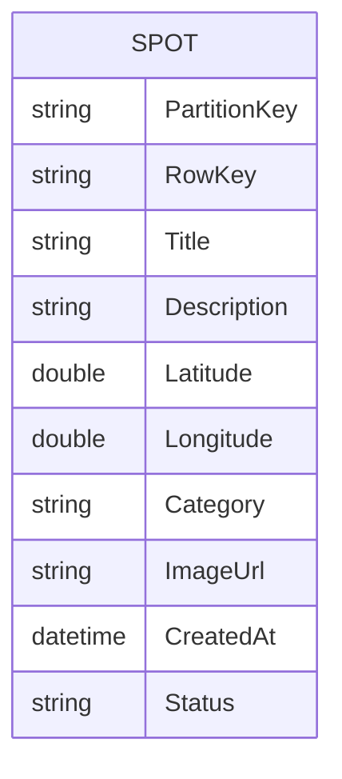

# データ設計書

## 1. 概要

C Spot Map Ver.1.0では、C級スポットの情報を  
Azure Table Storageに保存する。

投稿画像そのものはAzure Blob Storageに保存し、  
Table Storageには画像のURLだけを保存する。

## 2. データ構成



Ver.1.0ではユーザー登録、コメント、いいね、お気に入り機能を実装しないため、  
管理するデータはSpotエンティティのみとする。

## 3. Spotエンティティ

スポットの基本情報を管理する。

|項目名|データ型|必須|説明|
|---|---|---:|---|
|PartitionKey|string|○|データを分割して管理するためのキー|
|RowKey|string|○|スポットを一意に識別するID|
|Title|string|○|スポット名|
|Description|string|○|スポットの説明|
|Latitude|double|○|スポットの緯度|
|Longitude|double|○|スポットの経度|
|Category|string|○|スポットのカテゴリ|
|ImageUrl|string|○|Blob Storageに保存した画像のURL|
|CreatedAt|datetime|○|投稿日時|
|Status|string|○|公開状態|

## 4. キー設計

### PartitionKey

Ver.1.0では、すべてのスポットに次の値を設定する。

```text
SPOT
```

例：

```text
PartitionKey = "SPOT"
```

初期段階ではデータ件数が少ないことを想定し、  
一覧取得を簡単にするため同じPartitionKeyを使用する。

データ件数が増えた場合は、都道府県や地域単位で  
PartitionKeyを分割することを検討する。

例：

```text
TOKYO
KANAGAWA
SAITAMA
```

### RowKey

スポットごとに重複しないUUIDを設定する。

例：

```text
6f0a25a5-3c63-4d96-bc32-83aaf354cd72
```

Azure Table Storageでは、PartitionKeyとRowKeyの組み合わせによって  
データを一意に識別する。

## 5. カテゴリ

Ver.1.0では、次のカテゴリを使用する。

|値|説明|
|---|---|
|object|謎のオブジェやモニュメント|
|statue|石像や人物像|
|sign|珍しい看板や標識|
|retro|昭和感やレトロ感のある場所|
|building|不思議な建物や設備|
|other|上記に該当しないスポット|

画面には日本語名を表示し、  
データには英語の固定値を保存する。

## 6. 公開状態

Statusには次の値を保存する。

|値|説明|
|---|---|
|pending|確認待ち|
|published|公開中|
|rejected|非公開・却下|

Ver.1.0でも、不適切な投稿をそのまま公開しないように、  
投稿直後のStatusは原則として`pending`とする。

初期運用では管理者が内容を確認し、  
問題がなければ`published`へ変更する。

## 7. データ例

```json
{
  "PartitionKey": "SPOT",
  "RowKey": "6f0a25a5-3c63-4d96-bc32-83aaf354cd72",
  "Title": "公園の謎の巨大タコ",
  "Description": "住宅街の公園に突然現れる巨大なタコ型遊具。",
  "Latitude": 35.681236,
  "Longitude": 139.767125,
  "Category": "object",
  "ImageUrl": "https://example.blob.core.windows.net/spots/example.jpg",
  "CreatedAt": "2026-07-26T10:00:00Z",
  "Status": "pending"
}
```

## 8. Blob Storage設計

投稿画像は、Blob Storageの次のコンテナーに保存する。

```text
spot-images
```

ファイル名には重複を避けるためUUIDを使用する。

例：

```text
spot-images/6f0a25a5-3c63-4d96-bc32-83aaf354cd72.jpg
```

Ver.1.0では、1スポットにつき画像1枚とする。

## 9. 入力制限

|項目|制限|
|---|---|
|Title|1文字以上、100文字以内|
|Description|1文字以上、500文字以内|
|Latitude|-90以上、90以下|
|Longitude|-180以上、180以下|
|Category|定義済みカテゴリのみ|
|画像形式|JPEG、PNG、WebP|
|画像サイズ|5MB以下|

入力制限はフロントエンドだけでなく、  
Azure Functions側でも検証する。

## 10. 将来の拡張

今後、次のデータ追加を検討する。

- ユーザー情報
- コメント
- いいね
- お気に入り
- 複数画像
- 都道府県・市区町村
- 通報情報
- 閲覧数
- スポット評価

データ構造が複雑になった場合は、  
Azure Table StorageからAzure SQL Databaseへの移行を検討する。
